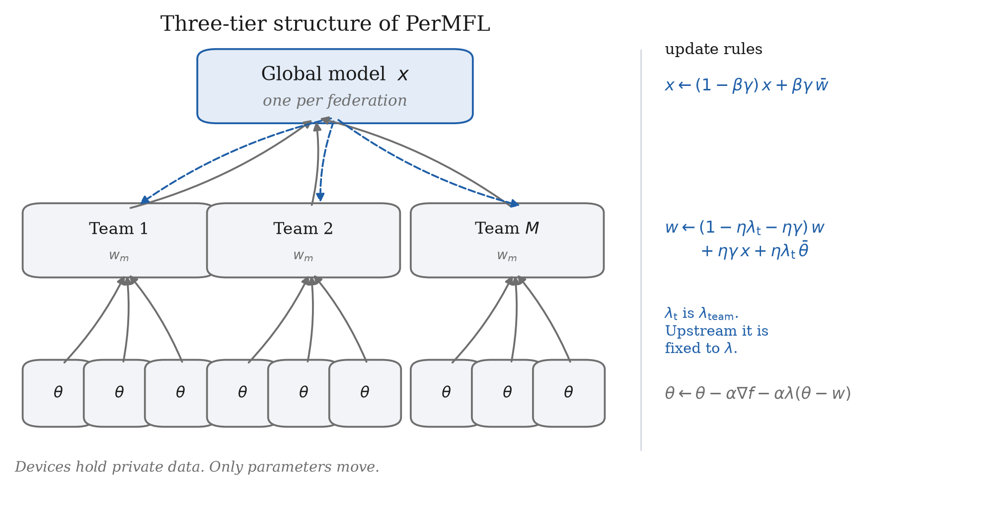
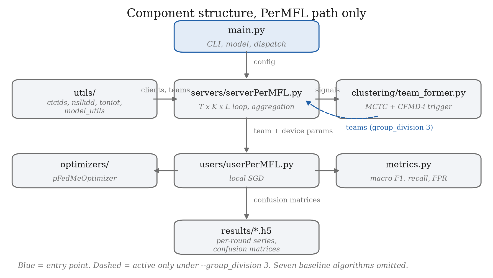
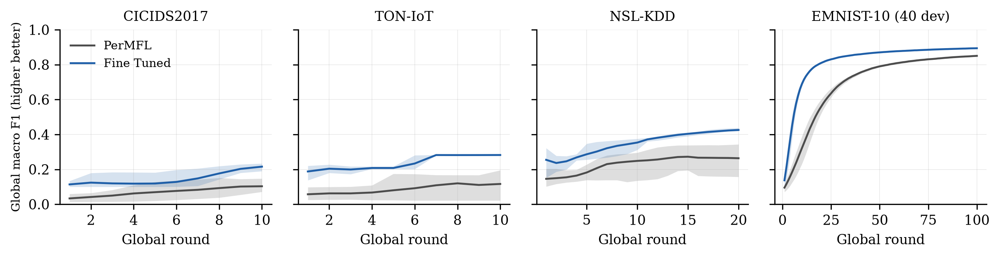
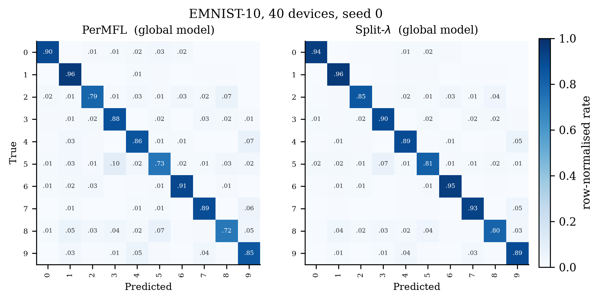
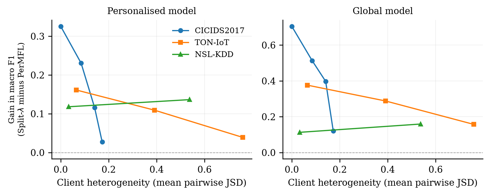

# Introduction

This chapter states the problem, identifies the gap in existing work that
motivates the project, sets out the aims and objectives against which the work
is assessed, and describes the structure of the remainder of the report.

## Background

Network intrusion detection systems classify traffic as benign or as belonging
to a class of attack. How well they work depends on the breadth of attack
traffic they have been trained on, which creates a difficulty: an organisation
would benefit from learning from attacks other organisations have seen, but
network traffic is among the most sensitive data it holds. Flow records reveal
internal addressing, service topology, user behaviour, and the fact of a
compromise when one has occurred.

Federated learning (McMahan et al., 2017) offers a way around this. Each
participant trains on its own records and transmits only model updates, which a
server averages into a shared model. No raw traffic leaves the participant.

The difficulty is that averaging works well when participants hold similar
data and poorly when they do not. An organisation running web services sees
different attacks from one running industrial control systems. Under this kind
of statistical heterogeneity a single averaged model fits nobody well, an
effect documented across the federated learning literature and particularly
sharp in intrusion detection, where attack classes are rare, unevenly
distributed, and specific to the environment that produced them.

Personalised federated learning addresses this by giving each participant a
model of its own while still sharing what can be shared. Multi-tier variants go
further and introduce an intermediate level between the device and the server,
on the argument that participants fall into groups and that a group-level model
captures what its members have in common without forcing agreement across
groups that have little to share.

## The base method

This project takes PerMFL (Bhuyan et al., 2024) as its base. PerMFL is a
three-tier personalised federated learning method with a device model, a team
model, and a global model, coupled by squared Euclidean penalties. It provides
convergence guarantees, linear for smooth strongly convex problems and
sub-linear for smooth non-convex ones, and its authors published an
implementation together with seven baseline algorithms.

Three properties made it the right base. It is reproducible, which most of the
adjacent literature is not. It carries a convergence proof, which the clustered
federated learning methods it competes with do not. And its stated premise, that
it applies "when there are known team structures across devices", maps onto
intrusion detection, where attack families and network segments provide exactly
that kind of structure.

## Problem statement

PerMFL has been evaluated only on image benchmarks and a synthetic tabular
dataset. Intrusion detection data differs from those in ways that bear directly
on the method's assumptions. Classes are severely imbalanced, with benign
traffic accounting for over eighty per cent of the CICIDS2017 capture. Several
attack classes have double-digit sample counts against millions of benign
flows. Traffic arrives in time order and attacks occur in contiguous bursts, so
the split between training and evaluation data is a methodological decision
rather than a formality. None of these conditions is present in MNIST.

The project asks whether the method transfers, what has to change for it to
transfer, and whether the architectural claim that motivates it holds on this
kind of data.

## Aims and objectives

The aim is to establish whether PerMFL is suitable for network intrusion
detection and, where it is not, to identify why and what corrects it.

  
1. Reproduce the published result on the authors' own dataset, to
        establish that the implementation under test behaves as the paper
        describes.
  
1. Build a leakage-free data pipeline for CICIDS2017, NSL-KDD and
        TON-IoT, with a documented partitioning scheme and an evaluation
        protocol appropriate to imbalanced multi-class detection.
  
1. Measure the method under controlled variation of client heterogeneity,
        reporting each result against the floor a trivial classifier achieves
        and the ceiling the same model reaches without federation.
  
1. Test the architectural premise directly by varying the team structure
        the method is built around.
  
1. Where the method underperforms, identify the mechanism and evaluate a
        correction.

## Contributions

The work makes four contributions.

An exact reproduction of the published EMNIST-10 result, matching the reported
personalised accuracy to within 0.04 percentage points, together with sixteen
documented defects in the released implementation. One of these, an argument
binding error, silently overrides a tunable hyperparameter with an unrelated
loop count.

Evidence that the team tier, the architectural feature that distinguishes
PerMFL from two-tier methods, contributes almost nothing within the parameter
region its own convergence conditions permit. Removing the tier entirely
changes personalised macro F1 by 0.0002 on CICIDS2017 and by 0.0000 on the
authors' own EMNIST-10 setup.

An explanation of why, derived from the update rule rather than inferred from
results. A single parameter governs both the device-to-team penalty and the
weight the team model places on its members, and the values these two roles
require are opposed.

A correction that separates them, evaluated across three datasets and four
partitioning schemes with five paired random seeds. It improves the global
model on three of four partitions and reduces its variance across seeds by two
to three orders of magnitude in all four, with one regression that is reported
rather than omitted.

## Report structure

Chapter~(see above) reviews personalised and clustered federated
learning, federated intrusion detection, and the data quality problems specific
to CICIDS2017. Chapter~(see above) states the functional and
non-functional requirements and the ethical and legal position.
Chapter~(see above) describes the experimental design, the partitioning
schemes and the evaluation protocol. Chapter~(see above) covers
the data pipeline, the metric instrumentation and the modifications to the base
implementation. Chapter~(see above) sets out how the pipeline was
verified. Chapter~(see above) presents the results and evaluates them
critically. Chapter~(see above) concludes and identifies further
work.

# Literature Review

This chapter reviews the work the project builds on. It covers personalised
federated learning, clustered and multi-tier variants, applications to
intrusion detection, and the data quality literature specific to CICIDS2017.
The final section identifies the gap the project addresses.

## Federated learning under heterogeneity

Federated averaging (McMahan et al., 2017) trains a single global model by
averaging client updates. It assumes clients hold data drawn from a similar
distribution. When they do not, the averaged model degrades, and the degradation
is worse the more the client distributions differ.

Two families of response exist. Personalised methods give each client its own
model while sharing structure with the others. Clustered methods group clients
by similarity and share within groups rather than globally.

pFedMe (Dinh et al., 2020) takes the first route using Moreau envelopes. Each
client solves a regularised local problem whose solution is pulled toward the
global model by a penalty term, so the client model can specialise without
drifting arbitrarily far. Ditto (Li et al., 2021) and Per-FedAvg
(Fallah et al., 2020) pursue related ideas through different regularisation
and meta-learning respectively.

## Clustered and multi-tier methods

Clustered federated learning assumes clients fall into groups. Sattler et al.
(Sattler et al., 2020) recursively bipartition clients by the cosine
similarity of their updates, splitting a cluster when its members' gradients
point in sufficiently different directions. The method splits but never merges
or reassigns, which limits it when the grouping is initially wrong.

FlexCFL (Duan et al., 2021) adds client migration between clusters to handle
distribution shift, keeping the number of clusters fixed. FedDrift
(Jothimurugesan et al., 2023) handles concept drift with both splits and
merges. A recent survey (Cfl Survey 2025) organises these approaches
and notes that basic clustered methods, limited to splitting, perform poorly
under complex drift.

HCFL+ [TO SUPPLY: authors for HCFL+ 2025, bib entry has no author field] generalises clustered federated learning into a
four-tier framework with dynamic re-clustering, unifying soft and hard
clustering under a common objective.

SCMoE-PFL (Li et al., 2026) combines soft clustering with a
mixture-of-experts. Its multi-centre threshold clustering allows a client to
belong to several clusters at once. Each cluster produces an expert model, each
client separately trains a private model, and an energy-aware gating network
fuses them. The clustering signal is the client gradient, L2-normalised to
discard magnitude and projected by PCA before cosine similarity is taken, the
projection being necessary because cosine similarity becomes uninformative in
high dimensions.

PerMFL (Bhuyan et al., 2024) differs from all of these in providing
convergence guarantees. It also differs in assuming the grouping is given
rather than derived. Its device update is

$$\theta_{i,j}^{t,k,l+1} = \theta_{i,j}^{t,k,l} - \alpha\nabla f_{i,j}(\theta_{i,j}^{t,k,l}) - \alpha\lambda\left(\theta_{i,j}^{t,k,l} - w_i^{t,k}\right),$$

its team update

$$w_i^{t,k+1} = (1 - \eta\lambda - \eta\gamma)\,w_i^{t,k} + \eta\gamma x^t + \lambda\eta\,\bar{\theta}_i^{t,k},$$

and its global update

$$x^{t+1} = (1 - \beta\gamma)x^t + \beta\gamma\bar{w}^t.$$

The parameter $\lambda$ appears in both the equation above and the equation above.
Section~(see above) returns to this.

## Federated learning for intrusion detection

CFMD-i (Zhang et al., 2026) applies clustered federated learning to intrusion
detection across five datasets including CICIDS2017. It clusters by model
discrepancy, switching between a parameter-space measure and an output-space
Kullback-Leibler divergence according to a threshold that adapts to the current
spread of pairwise similarities. Clustering is triggered adaptively rather than
at a fixed round, on two conditions: the maximum inter-client model difference
must exceed a threshold, indicating enough heterogeneity to distinguish groups,
while the mean difference must stay below another, indicating shared structure
remains. Its contribution is communication efficiency, reporting a reduction of
over ninety-five per cent through parameter-difference transmission, adaptive
leapfrog communication and quantised error feedback.

Its client construction is relevant here. CFMD-i partitions traffic into attack
domains and assigns each participant one domain in its first scenario and
several in its second, so group structure exists by construction rather than
being imposed by a random draw.

ClusterFed (Irtiza et al., 2025) uses self-supervised clustering with
balanced assignment via Sinkhorn-Knopp, which prevents cluster collapse. It
partitions clients by Dirichlet sampling at $\alpha = 0.1$.

Stones From Other Hills (Lu et al., 2025) studies self-labelled personalised
federated learning for IoT intrusion detection. Two aspects matter for this
project. It sweeps the degree of label skew, reporting FedAvg, a local baseline
and its own method at each level, and identifies an intermediate setting as the
usable balance: too much class overlap leaves nothing for personalisation to
exploit, too little prevents convergence. It also evaluates clients on classes
absent from their training data, so that adaptation to unseen traffic can be
measured.

Fed-ANIDS (Idrissi et al., 2023) takes an anomaly detection approach,
training autoencoders on normal traffic only and treating reconstruction error
as an intrusion score.

## Data quality in CICIDS2017

CICIDS2017 (Sharafaldin et al., 2018) is the most used benchmark in this
area, and the literature documents several defects that inflate reported
results when unaddressed.

Flow rate columns contain infinities where a rate was computed over a
zero-length flow, and the dataset contains a substantial number of duplicate
rows. Reported practice is to drop both, or to impute the infinities with a
column median fitted inside the training fold. Identifier columns, addresses,
ports, timestamps and flow identifiers, must be removed before the feature
matrix is built, because a personalised model can otherwise score well by
recognising which client it is serving.

Percentile clipping is applied in several published pipelines to bound the
extreme values typical of flow statistics.

Class imbalance is severe. Benign traffic is roughly eighty-two per cent of the
capture, so accuracy is uninformative: a classifier that never raises an alert
scores above 0.81. Macro-averaged F1 weights each class equally and does not
use the true negative cell, which is why it separates a working detector from a
trivial one where accuracy does not.

## Gap

Three gaps motivate the project.

PerMFL has not been evaluated on intrusion detection data. Its premise concerns
known team structures, and intrusion detection supplies them naturally, but no
published work tests it there.

The clustered methods that do address intrusion detection derive their
groupings and offer no convergence analysis; PerMFL offers the analysis but
assumes the grouping. Neither literature examines what the assumed grouping
actually contributes.

Where clustering methods report null or weak results, the partition is rarely
examined as a possible cause. Dirichlet partitioning produces a continuum of
client distributions rather than discrete groups, so a clustering algorithm has
nothing recoverable to find, and a null result measures the partition rather
than the method.

# Requirements, Ethics and Legal Position

This chapter states what the software had to do, the constraints it operated
under, and the ethical and legal position of the work.

## Functional requirements

  
- **F1 Reproduce the base method.**  Run PerMFL unmodified on the authors'
    own dataset and compare against the published figure. Without this, no
    later result can be attributed to a change rather than to a broken
    implementation.
  
- **F2 Load intrusion detection data.**  Parse CICIDS2017, NSL-KDD and
    TON-IoT into the four-tuple interface the existing loaders expose, so that
    every algorithm in the codebase runs on them without modification.
  
- **F3 Partition clients under controlled heterogeneity.**  Support
    attack-domain, label-skew, Dirichlet and host-based partitioning, with the
    degree of skew settable and measurable.
  
- **F4 Report metrics appropriate to imbalanced detection.**  Macro-averaged
    F1, precision, recall and false positive rate, per class and pooled, in
    addition to the accuracy the base implementation reports.
  
- **F5 Support repeated runs.**  Vary model initialisation and partitioning
    by seed so that variation across runs can be measured.
  
- **F6 Derive teams from client updates.**  Form teams during training from
    the client state rather than at load time, since a data-derived grouping
    cannot be computed before any client has trained.
  
- **F7 Evaluate on unseen classes.**  Support evaluation of clients on
    classes absent from their training data.

## Non-functional requirements

  
- **N1 Reproducibility.**  A run must be reproducible from a recorded seed
    and command. Package versions are pinned to the period of the base paper's
    publication.
  
- **N2 No information leakage.**  No statistic fitted on evaluation data may
    influence training. Scaling parameters, clipping bounds and imputation
    values are fitted on the training split only.
  
- **N3 Commodity hardware.**  Experiments must complete on a laptop CPU. No
    result may depend on access to a GPU cluster.
  
- **N4 Backward compatibility.**  Every modification defaults to the released
    behaviour, so results obtained before a change remain reproducible after
    it.
  
- **N5 Traceability.**  Each defect identified in the base implementation is
    recorded with a file and line reference and, where its effect is
    measurable, a measurement.

## Ethical position

### Data

The project uses three public datasets released for research. CICIDS2017 and
NSL-KDD were produced by the Canadian Institute for Cybersecurity, TON-IoT by
UNSW Canberra. All three were captured in purpose-built testbeds using
synthetic user profiles and scripted attacks. No traffic from a real
organisation or an identifiable individual is involved, and no attempt is made
to re-identify any host.

The IP addresses in the captures belong to testbed machines. They appear in the
raw files and are used in one partitioning scheme to define client boundaries,
which reflects how a deployed system would be organised. They are removed
before the feature matrix is constructed, both to prevent the model learning
addresses instead of behaviour and because address-derived features do not
transfer outside the testbed.

### Ethical approval

The project involves no human participants, no personal data as defined by UK
GDPR, and no interaction with live systems. Approval was obtained under
reference [TO SUPPLY: EthOS number].

### Dual use

Intrusion detection research is defensive, but any work that characterises
where a detector fails also indicates where it could be evaded. The findings
here concern the internal parameterisation of a federated learning method
rather than exploitable weaknesses in a deployed system, and the datasets are
public and well studied. The risk is low. No detection evasion technique is
developed or evaluated.

### Reporting

Results are reported whether or not they support the hypothesis. The evaluation
in Chapter~(see above) includes a configuration in which the proposed
correction makes matters worse, and a claim from an earlier stage of the work
that later measurement contradicted. Both are retained.

## Legal position

The base implementation is released by its authors under the MIT licence. This
work is a derivative and carries the same licence with attribution preserved.
Dataset licences permit academic use with citation, and all three are cited.
No dataset is redistributed; the repository contains loaders and a download
procedure.

## Scope

Three exclusions are deliberate.

No comparison against SCMoE-PFL or CFMD-i is attempted. Neither publishes an
implementation, and comparing against a reimplementation would measure the
reimplementation. This also means no claim is made about relative computational
efficiency, since establishing one would require running both.

Differential privacy and secure aggregation are out of scope. The threat model
here is statistical heterogeneity, not an adversarial server.

Attack detection is treated as multi-class classification over labelled
traffic. Unsupervised anomaly detection, as in Fed-ANIDS, is a different
problem.

# Design

This chapter sets out the experimental design: the architecture under test, the
partitioning schemes, the evaluation protocol, and the reasoning behind each
choice.

## Architecture under test

PerMFL holds three models, each a complete copy of the network rather than a
subset of its layers. A device model $\theta_{i,j}$ belongs to device $j$ in
team $i$, a team model $w_i$ to each of the $M$ teams, and a global model $x$
to the server. Figure~(see above) shows the arrangement and the direction
of each coupling.

The training loop nests three counters. Each global round $t$ runs $K$ team
rounds, and each team round runs $L$ local gradient steps on every
participating device. At the start of a global round every team model is
overwritten with the current global model. At the start of every team round
every device model is overwritten with its team's model. A device therefore
travels at most $L$ steps from its team model before being reset, a property
that Section~(see above) shows to be the dominant influence on personalised
performance.

Communication cost follows from the loop structure. Each team round broadcasts
the team model to its devices and collects their updates, so device-to-server
transfers per global round are $2KN$ for $N$ devices in total. The number of
teams cancels: five teams of four and one team of twenty cost the same.

## Partitioning schemes

How clients are constructed determines what any clustering method can recover
and how much a group-level model can contribute. Four schemes are implemented.

### Attack domain

Each attack family is assigned to a group of clients, following CFMD-i's first
scenario. Benign traffic is distributed uniformly across every client, since a
detector with no notion of normal traffic has no decision boundary to learn.
Clients are dealt to domains in rotation and then shuffled, so that client index
does not encode domain membership. Without the shuffle, a clustering that
recovered index order would be indistinguishable from one that recovered
structure.

This scheme is the only one that supplies ground truth. Every client carries a
known domain label, so a derived partition can be scored against it with the
adjusted Rand index rather than argued about through downstream accuracy.

### Label skew

Each client receives a fixed number $k$ of attack classes, dealt in rotation so
that neighbouring clients overlap and every class has a similar number of
holders. Sweeping $k$ produces a heterogeneity ladder, following the approach in
Stones From Other Hills, which reports a federated baseline, a local baseline
and its own method at each level.

### Dirichlet

The standard approach in the clustered federated learning literature. Class
proportions per client are drawn from a Dirichlet distribution with
concentration $\alpha$, lower values producing more skew. It is included for
comparability, with the caveat noted in Section~(see above): it produces a
continuum rather than discrete groups, so it cannot support a ground-truth
clustering evaluation.

### Host based

One client per destination host, which is what a deployed system looks like:
one agent per machine. Most victim hosts in these captures see a single attack
type, so hosts are selected by the entropy of their label distribution, an
approach taken from DP-FL. Without that filter every client would hold one
class and the partition would be degenerate.

## Controlling and measuring heterogeneity

Two independent controls are provided.

The first is the partition itself, through $k$ or $\alpha$. The second is the
proportion of benign traffic retained per client. At eighty-two per cent benign,
every client's label distribution is dominated by the same class, which
compresses any divergence measure regardless of how the attacks are split.
Thinning benign traffic on the training split makes the underlying structure
visible without altering the partition. It is applied to training data only:
the evaluation set must reflect operational traffic, and thinning it would
inflate macro F1 by shrinking the majority class in the denominator.

Heterogeneity is reported as the mean pairwise Jensen-Shannon divergence
between client label distributions, which is zero when clients are identical
and one when they are disjoint, alongside the effective number of classes per
client.

## Evaluation protocol

### Metrics

Accuracy is reported but is not the headline. On a corpus that is eighty-two
per cent benign, a classifier that never raises an alert scores 0.8171. The
reason is structural: accuracy uses the true negative cell, which dominates
under imbalance. For a single attack class in the CICIDS2017 evaluation set, a
detector that never fires records per-class accuracy between 0.955 and 0.992
while recording zero recall.

Macro-averaged F1 is the headline metric. It weights every class equally and,
uniquely among the composite measures considered, does not use the true
negative cell at all. Recall is reported as the detection rate an operator
tunes toward, and false positive rate as the alert volume they tune against.

Every result is reported against two anchors: the floor a majority-class
classifier achieves, and the ceiling the same model and optimiser reach when
trained centrally on the pooled data.

### Splits

Two splits are used. The temporal split orders each client's rows by timestamp
within each class and takes the earliest seventy-five per cent for training.
Splitting within class rather than within client is necessary because attacks
occupy contiguous time windows: a flat split by time assigns the test set
whichever attack ran last and places the others entirely in training. The random
split is stratified and serves as the comparison.

Both were measured. The difference between them is 0.0001 macro F1, so the
random split is used for the main results and the temporal split is reported as
an ablation.

### Evaluation on unseen classes

Under the cross-test protocol, held-out rows are redistributed across all
clients regardless of what each trained on, so every client is evaluated on
every class. This follows Stones From Other Hills, where a gateway trained on
one set of classes is tested on a partly disjoint set to measure adaptation to
unseen traffic.

The protocol imposes a structural ceiling. A client can only predict classes it
has trained on, so a class held by $h$ of $N$ clients has pooled recall bounded
by $h/N$ and F1 bounded by $2(h/N)/(1 + h/N)$ even under perfect
classification. This bound is computed for every configuration and reported
alongside the achieved value, because a score of 0.34 against a ceiling of 0.41
is a different result from 0.34 against a ceiling of 1.0.

## Experimental design

Comparisons are paired: both configurations under test see the same partition
and the same initialisation for a given seed, so the difference isolates the
change. Five seeds are used for headline comparisons and three for exploratory
sweeps, with a paired $t$ test. Three seeds is treated as indicative only; at
$n=3$ the critical value is 4.303 and the statistic is dominated by seed
variance.

Results that fall below a difference of 0.03 macro F1 are treated as noise. That
threshold comes from measurement: two runs of an identical configuration
differed by 0.0116, so anything smaller cannot be distinguished from run-to-run
variation.

# Implementation

This chapter describes the data pipeline, the modifications made to the base
implementation, and the defects found while making them.

## Environment

The base implementation ships no dependency versions. Packages were pinned to
the releases current at the base paper's submission: torch 2.3.1, torchvision
0.18.1, numpy 1.26.4, pandas 2.2.2. This is not conservatism for its own sake.
The optimiser module uses a positional-alpha overload of `Tensor.add\_`
that later torch releases reject, so the Per-FedAvg baseline fails outright on a
current install.

All experiments run on CPU. Threading was measured rather than assumed: the
default of one thread per core is slower than a single thread for these model
sizes, by twenty-two to thirty-nine per cent, because the matrix products are
too small for the synchronisation cost to pay. Runs are therefore pinned to one
thread and parallelised across configurations instead.

## Data pipeline

### CICIDS2017

Two distributions of CICIDS2017 exist. The machine learning variant carries
seventy-eight features and a label; the traffic labelling variant adds flow
identifier, addresses, ports and timestamp. Only the second supports a temporal
split, and only the second supports the host-based partition, so it is the one
used. This distinction matters beyond this project: a temporal split performed
on the first variant can only be positional, since it holds no time column.

Cleaning proceeds in four steps. One file contains 288,602 rows in which every
field is empty; removing them leaves a total of 2,830,743, matching the
canonical figure. Seven of the eight files record timestamps in twelve-hour
form with no meridiem, so the Wednesday capture appears to run from 08:42 to
02:43; since the capture window is 08:00 to 17:00, hours one to seven are
afternoon and are advanced by twelve. Rows carrying infinities or missing values
in the flow rate columns are dropped along with exact duplicates, 309,745 rows
in total. Identifier columns are removed before the feature matrix is built.

Classes below a configurable threshold are dropped. At 2,000 rows this removes
Bot, the three web attack variants, Infiltration and Heartbleed, leaving nine
classes. The threshold exists because a class with eleven rows in the entire
capture cannot survive a seventy-five/twenty-five split, and its F1 contribution
is noise that enters the macro average with equal weight.

Feature values are clipped to percentile bounds fitted on the training split
and then standardised, also on training statistics only. Clipping was added
after measuring the range: fifty-eight of seventy-nine features have a
maximum-to-median ratio above $10^4$ and forty-three above $10^6$.

### NSL-KDD and TON-IoT

NSL-KDD ships a canonical train and test split, so no split has to be designed
and the questions raised in Section~(see above) do not arise. Its
three categorical columns are one-hot encoded, giving 122 features over five
classes: normal plus the four documented attack domains.

TON-IoT contributes its network subset, 211,043 rows over ten classes. It is
included because it is near-balanced where CICIDS2017 is not: normal traffic is
23.7 per cent against 81.7, so the accuracy floor is 0.2369 rather than 0.8171
and macro F1 has room to move. Addresses are dropped as features, since the
attacker hosts are a fixed range and would leak the label, but the destination
address is retained to define the host-based partition.

## Metric instrumentation

The base implementation records accuracy and loss only. No confusion matrix is
constructed anywhere in it, and the published paper reports no F1, recall or
precision.

A metrics module was added computing macro-averaged F1, precision, recall and
false positive rate from a pooled confusion matrix. Two decisions in it matter.

The average is taken over the complete label set, with classes absent from a
test slice contributing zero. Averaging only over classes that happen to appear
inflates personalised methods, because each device holds a subset of classes
and would otherwise be graded only on those.

The matrices are summed across clients before the F1 is taken. Averaging
per-client F1 scores instead produces a different and more flattering number,
for the same reason.

Confusion accumulation is vectorised through `bincount`. The obvious
Python loop over prediction pairs dominates the round loop at these test set
sizes.

## Modifications to the base implementation

Four changes were made, each defaulting to the released behaviour.

### Argument binding

`UserPerMFL` passed five positional arguments into the six parameter
slots that follow `beta` in the base class, shifting every subsequent
binding by one. The `--lamda` argument was bound to `self.eta` and
`--local\_iters` to `self.lamda`. The optimiser therefore received
a penalty weight of twenty, the local iteration count, rather than the value
supplied on the command line. The per-step pull toward the team model was 0.2
where the paper's own setting gives 0.005, a factor of forty.

The correction is keyword arguments. Since `self.eta`,
`self.gamma` and `self.local\_epochs` are assigned but never read
in this class, the penalty weight is the only behavioural change.

### Seeding

`torch.manual\_seed(0)` was fixed in the entry point, the loaders fix
their own seeds, and client selection seeds on the round index. Under sequential
team assignment nothing varied between repeats, so the repeat count produced
identical runs and no standard deviation could be reported. This is consistent
with the standard deviations of exactly zero reported throughout the base
paper's main results table. A seed argument now drives all three.

### Decoupled team weight

Equations~the equation above and~the equation above both contain $\lambda$.
Section~(see above) shows the two roles want opposed values. A
second argument sets the team-update weight independently, defaulting to the
device value so that unmodified behaviour is preserved.

### Team formation from client updates

Teams are assigned in the data loader, before any client has trained, so no
update-based grouping can be computed there. A clustering module was added that
runs in the server's round loop instead. The signal is the proximal residual
$\theta_{i,j} - w_i$, which the device update already computes. It measures how
far a device would move given the pull its team exerts, which neither of the
comparable methods can use, since neither has a proximal term. Formation follows
SCMoE-PFL's procedure: L2 normalisation, PCA, cosine similarity, centres seeded
from the least similar pairs. Assignment is hard and size-constrained rather
than soft and overlapping, because the server sizes its team arrays statically
and divides by per-team sample counts.

## Defects in the base implementation

Sixteen defects were catalogued. Those that affect results are listed here; the
remainder appear in Appendix~[TO SUPPLY: ref].

  
- **Argument binding.**  As above. Silently overrides a documented
    hyperparameter.
  
- **Non-reproducible partitioning.**  Random team assignment reseeds on the
    wall clock and prints the seed, so teams differ on every run at a fixed
    torch seed. The clock seed then propagates into per-round team selection.
  
- **Unseeded synthetic split.**  The synthetic loader seeds numpy but not
    Python's random module before the per-client shuffle, so the split differs
    between processes. Verified by hashing across three runs.
  
- **Broken partitioning mode.**  One of the three team assignment modes
    assigns the return value of an in-place shuffle, which is `None`,
    then indexes it. That mode has never executed.
  
- **Dataset mislabelling.**  The EMNIST path loads the sixty-two class
    by-class split, which the paper distinguishes as a separate dataset. The
    paper states the digits split was used.
  
- **Unreachable branch.**  A reshape guard tests a dataset name that differs
    in case from the value the parser accepts, so that dataset skips the
    reshape and its convolutional path cannot run.
  
- **Silent no-op.**  The experiment counter is both the loop start and
    compared against the repeat count, so a start index at or above the repeat
    count performs no work and exits zero.
  
- **Result overwriting.**  Output filenames encode the hyperparameters but
    not the round count, client count or local iteration count, so runs
    differing only in those overwrite each other.
  
- **Unreachable algorithm.**  The parser accepts an algorithm name that the
    dispatch does not match, so selecting it raises a name error. It is one of
    the base paper's headline comparison methods.
  
- **Broken aggregation helper.**  The routine that averages results across
    repeats is commented out at its call site and passes two arguments to a
    three-argument definition.
  
- **Missing regularisation.**  Appendix D.3 describes multinomial logistic
    regression with L2 regularisation. No weight decay or penalty term appears
    anywhere in the repository. This matters for the strongly convex
    convergence result, whose step size bound depends on a strong convexity
    modulus that is zero without it.
  
- **Model depth.**  Sections 4 and D.3 describe networks with two hidden
    layers. The implementation has one. Both were measured; the paper's
    description performs worse on this data by 0.011 to 0.021 macro F1.

# Testing and Verification

Nothing in this project is user-facing, so testing means establishing that the
pipeline produces what it claims and that measured differences come from the
change under test. This chapter records how each part was verified and which
checks caught real errors.

## Verifying the reproduction

The first test was whether the unmodified implementation reproduces its
published result. Running it on EMNIST-10 for four hundred global rounds gave a
peak personalised accuracy of 96.45 per cent against the 96.49 reported in the
paper, a difference of 0.04 percentage points.

This matters more than a sanity check. The run carries the argument binding
defect, since it is present in the released code, and it still lands on the
published figure. That is evidence the defect was present when the paper's
results were produced, and it licenses treating later measurements as changes
to the method rather than symptoms of a broken build.

## Loader invariants

Each loader is checked against six invariants before use.

No row appears in both the training and evaluation split for a client. Every
class present in the corpus appears in both the pooled training and pooled
evaluation sets. The pooled training features have approximately zero mean and
unit standard deviation, confirming the scaler was fitted and applied. No
non-finite values survive. The per-client, per-class split ratio lies within
0.70 and 0.80 of the intended 0.75. No client is empty and no team is empty.

The team check exists because it caught a real defect. One loader's sequential
assignment hardcodes its group boundaries to two specific client indices rather
than computing them, which at forty clients produces groups of eleven, twenty-six
and three and leaves the fourth team with no members. A team with no members
divides by zero when its sample proportion is computed.

## Errors the checks caught

Four errors reached a run before being caught, and the way each surfaced is
worth recording.

### A split that produced empty test classes

The first temporal split ordered each client's rows by time and cut at
seventy-five per cent. Attacks in CICIDS2017 occupy contiguous windows, so this
gave the evaluation set whichever attack ran last and placed the others entirely
in training. Wednesday clients trained on 2,913 denial-of-service samples and
were evaluated on none.

The symptom was not an exception. It was that the personalised models scored
0.45 accuracy where a classifier that always predicts benign scores 0.82. A
model below the majority-class baseline indicates a setup fault rather than a
weak method, and that comparison is the check that caught it. The correction is
to split each class on its own timeline.

### A control flow error that passed the syntax check

A guard inserted between a conditional branch and its trailing `else`
turned the construct into a `for`-`else`, which is valid Python.
The `else` then bound to the loop and raised on every call. Eight queued
runs each exited in three seconds. The parser had accepted the file.

The lesson recorded here is that a syntax check is not an execution check. Every
subsequent queue was preceded by a single short run of the same configuration.

### An undefined name from statement ordering

A module-level assignment reading an environment variable was inserted above the
import that provides the module it calls. Forty-six queued runs failed
identically. Again the file parsed.

### A metric measured against a moving target

Benign thinning was initially applied before the train and test split, so it
thinned both. The accuracy floor moved from 0.8171 to 0.7008, meaning
comparisons across thinning settings sat on different evaluation targets. The
correction, following the reference implementation, applies thinning to the
training split only, leaving the evaluation set at its natural class balance.
The floors are now constant across settings.

## Verifying the modifications

Each modification was verified by measuring the quantity it was supposed to
change.

For the argument binding fix, the optimiser's penalty weight was read directly
before and after: twenty before, matching the local iteration count, and the
supplied value after. The per-step pull changed from 0.2 to 0.05 as predicted.

For seeding, an identical configuration was run at two seeds and the results
compared. Before the change they were identical to four decimal places; after
it they differed.

For the synthetic split fix, the split was hashed across three separate
processes. Before the change the three hashes differed; after, they matched.

The clustering module was tested against synthetic data with known group
structure: twenty points drawn from five well-separated latent clusters. It
recovered them at an adjusted Rand index of 0.762 with equal group sizes, and
the trigger fired on separated data while holding off on near-identical data.

## Establishing what counts as a difference

A measurement is only interpretable against the variation of the measurement
itself. Two runs of an identical configuration, differing only in their
position in the experiment schedule, gave personalised macro F1 of 0.7318 and
0.7244, a difference of 0.0074.

Differences below roughly 0.01 are therefore not distinguishable from
run-to-run variation, and a threshold of 0.03 was adopted before results were
examined. Several comparisons fall below it and are reported as null rather than
as small effects. The largest such is 0.0016, which is an order of magnitude
inside the floor.

## What was not tested

There is no unit test suite. The base implementation ships none, and adding one
would have meant characterising behaviour the project set out to question.
Verification here is at the level of measured invariants and reproduced
published figures, which suits an experimental study but would not suit
software intended for use.

The CUDA path is untested. All experiments ran on CPU and no GPU was available.
The device selection logic is exercised only in its CPU branch.

# Evaluation

This chapter presents the results and evaluates them. Section~(see above)
tests the architectural premise, Section~(see above) explains the
mechanism behind the failure, Section~(see above) evaluates the
correction, and Section~(see above) assesses the work as a whole
including what it does not establish.

Every result reports the floor a majority-class classifier achieves. Where the
evaluation protocol imposes one, the structural ceiling is reported too.

## Does the team tier contribute?

PerMFL's premise is that it applies when known team structures exist across
devices. The direct test is to vary the team structure and measure the effect.

Two experiments were run. The first compares team assignments: teams matching
the true attack domains, teams assigned at random, and teams derived from client
updates during training. The second removes the tier by setting the team count
to one, holding the total local computation constant so that the comparison is
not confounded by training volume.

Across three datasets the result is the same. On CICIDS2017, moving from one
team to ten changes personalised macro F1 by 0.0002. On EMNIST-10, the base
paper's own dataset at its own parameter setting, the change is 0.0000. On
NSL-KDD it is 0.0011. Against a measured noise floor of 0.0116, all three are
unmeasurable.

Assignment makes no difference either. Teams matching the true day-domains do
not beat random assignment on any dataset, and derived teams do not beat either.
The largest difference across five such comparisons is 0.0016.

One configuration does show an effect. At $\lambda = 1.5$ the tier contributes
0.0342 macro F1 on CICIDS2017, above the threshold. But the paper's own
convergence condition requires $\gamma > 2\lambda$, which at $\gamma = 1.5$
caps $\lambda$ below 0.75. The setting where the tier does something lies
outside the region the theory permits. Within that region the contribution is
at most 0.0221, and operating there costs 0.157 macro F1 relative to the tuned
setting where the tier does nothing.

## Why: one parameter, two jobs

The explanation is in the update rule rather than in the results.

$\lambda$ appears twice. In the device update the equation above it scales the
penalty pulling a device toward its team, so a smaller value permits more
personalisation. In the team update the equation above it weights $\bar{\theta}_i$,
the average of the team's members, which is the only term in that equation
carrying any information about who is in the team.

The relative weight of that term is $\lambda\eta / \eta\gamma = \lambda/\gamma$.
At the tuned setting of $\lambda = 0.05$ with $\gamma = 1.5$, the members'
average is weighted 0.0015 against a pull of 0.045 toward the global model, so
membership influences the team model by 3.3 per cent. The team model is
effectively a copy of the global model, which is why the number of teams makes
no difference.

The convergence condition bounds this. Since $\gamma > 2\lambda$ implies
$\lambda/\gamma < 0.5$, a team model can never take more than half its update
from its own members within the region the theory permits.

Tracing the consequence for the global model: substituting $w = x$ at the start
of a round gives $w \approx 0.9985x + 0.0015\bar{\theta}$, and after the global
update the server model moves by roughly 0.00135 of the direction its devices
indicate. Over ten rounds it travels about 1.35 per cent from its
initialisation. The measured global accuracy of 0.0495 on nine classes, below
the 0.111 a uniform random classifier achieves, is consistent with a model that
has not left its starting point.

The two roles want opposite values. Personalisation wants $\lambda$ small; a
functional global model wants it comparable to $\gamma$. The published
parameterisation forces a choice.

## Decoupling the two roles

Separating them is a one-parameter change. The device penalty keeps $\lambda$;
the team update takes an independent weight.

### Headline comparison

On CICIDS2017 with attack-domain partitioning, benign traffic thinned to
twenty-five per cent of the training split, and evaluation on unseen classes,
across five paired seeds:

| metric | PerMFL | Split-λ | difference | paired t |
|---|---|---|---|---|
| Personal macro F1 | 0.4182 pm 0.0364 | 0.5086 pm 0.0168 | +0.0904 | 4.29 |
| Personal accuracy | 0.8390 pm 0.0081 | 0.9041 pm 0.0107 | +0.0651 | 9.28 |
| Global macro F1 | 0.1165 pm 0.0178 | 0.2457 pm 0.0064 | +0.1292 | 15.68 |
| Global accuracy | 0.7545 pm 0.0497 | 0.8626 pm 0.0013 | +0.1081 | 4.76 |
| Global macro recall | 0.1604 pm 0.0370 | 0.2269 pm 0.0043 | +0.0664 | 4.07 |

All four exceed the critical value of 2.776 and win on every seed. The floors
are 0.8171 accuracy and 0.0999 macro F1. The PerMFL global model sits below the
accuracy floor; the Split-λ one sits above it.

## The paper's own configuration

The results above use configurations chosen for this project. The strongest test
of a correction to a published method is whether it holds at that method's own
stated setup, so the comparison was repeated on EMNIST-10 with forty devices in
four teams of ten, full participation, four hundred global rounds, ten team
rounds and twenty local steps, multi-class logistic regression, lambda 0.5,
gamma 1.5, beta 0.6 and alpha 0.01. Every one of those values is taken from the
paper. Three seeds, paired.

| Metric | Direction | PerMFL | Split-λ | Delta | t |
|---|---|---|---|---|---|
| Personalised macro F1 | higher better | 0.9787 | 0.9786 | -0.0001 | -1.03 |
| Personalised accuracy | higher better | 0.9796 | 0.9795 | -0.0001 | -0.65 |
| Global macro F1 | higher better | 0.9018 | 0.9176 | +0.0158 | 33.35 |
| Global accuracy | higher better | 0.9053 | 0.9206 | +0.0152 | 39.38 |
| Global macro recall | higher better | 0.9022 | 0.9180 | +0.0158 | 42.39 |
| Global macro FPR | lower better | 0.0105 | 0.0088 | -0.0017 | -41.19 |

The critical value at two degrees of freedom is 4.303. The four global metrics
clear it by an order of magnitude and win on every seed. The three personalised
metrics do not clear it, and their deltas are negative here where they were
marginally positive at a shorter horizon. The correct reading is that the
personalised model is unaffected, which is what the update rules predict, since
the separated parameter enters only the team update.

The published figures for this cell are 96.49 personalised accuracy and 91.68
global accuracy. Measured against the latter:

| Configuration | Global accuracy by seed | Mean | Versus 91.68 |
|---|---|---|---|
| PerMFL | 90.45, 90.65, 90.51 | 90.53 | -1.15, exceeds on none |
| Split-λ | 92.03, 92.09, 92.05 | 92.06 | +0.38, exceeds on all three |

The two arms do not overlap and fall either side of the published number. Both
have converged: over the final fifty rounds the global model gains 0.0048 points
per round under the published coupling and 0.0019 under the separated one, so
the remaining difference is not an artefact of stopping early.

The claim this supports is narrow and worth stating precisely. Under the paper's
own configuration, at a horizon where both arms have converged, separating the
two roles of lambda reaches the published global accuracy on every seed while
the published coupling reaches it on none. It does not support the broader claim
that the method has been beaten, because the paper reports one figure per cell
without stating whether it is a final or a best value, and the comparison here
uses a peak.

The size of the gain depends on the horizon. At one hundred global rounds the
global accuracy gain is 0.0418; at four hundred it is 0.0152. Longer training
lets the published coupling recover much of the deficit unaided, but not all of
it. The correction therefore buys both faster convergence and a better converged
model, and the first effect is the larger of the two.

## Where the operating point sits

The comparison above uses $\lambda_{team} = 1.5$, chosen before any sweep. A
later sweep over six values shows that choice was conservative.

| $\lambda_{team}$ | ratio to $\gamma$ | personal macro F1 | global macro F1 | global FPR |
|---|---|---|---|---|
| 0.5 | 0.3 | 0.4168 | 0.1529 | 0.0887 |
| 1.0 | 0.7 | 0.4383 | 0.2169 | 0.0816 |
| 1.5 | 1.0 | 0.5202 | 0.2480 | 0.0788 |
| 3.0 | 2.0 | 0.5818 | 0.2603 | 0.0757 |
| 6.0 | 4.0 | 0.6480 | 0.4046 | 0.0642 |
| 12.0 | 8.0 | 0.8440 | 0.5341 | 0.0475 |

Monotone on both tiers and on false-positive rate, with no turnover. The
stability condition permits values below 31.8, so the sweep exhausted its range
rather than finding an optimum.

The operating point matters for more than the headline figure. Per-class
detection on the global model, at three settings:

| configuration | classes detected | attack classes sent entirely to benign |
|---|---|---|
| PerMFL | 2 of 9 | 3 of 8 |
| Split-λ, $\lambda_{team} = 1.5$ | 3 of 9 | 5 of 8 |
| Split-λ, $\lambda_{team} = 12.0$ | 7 of 9 | 1 of 8 |

At 1.5 the global model is not usable as a detector, and its errors concentrate
on the benign class, which is the more dangerous failure in this setting because
a misclassified attack still raises an alert while a benign classification does
not. At 12.0 four further classes gain detection and that failure mode largely
disappears.

Against this, at 12.0 the team model is weighted eight times more toward its own
members than toward the global model, which is closer to a per-team federated
average with a weak global anchor than to the method as published. The results
below use 1.5 throughout, and the higher setting is reported as evidence that
the correction is not exhausted rather than as the configuration under test.

## Two mechanisms that did not help

Two changes were implemented and measured, and neither moved a metric. Both are
recorded because a negative result narrows the space of explanations.

The drift-triggered reclustering was run with thresholds read from 1782 logged
reclustering events rather than chosen a priori. Gating reduced reclustering from
99 rounds in 100 to roughly 25 and halved the variance of cluster agreement, and
changed no metric on either tier by more than one standard deviation. Cluster
agreement with the true partition stayed near 0.32 at every setting, so the
clustering never recovers the domain structure it is intended to find.

A class-weighted loss was implemented on the hypothesis that the objective and
the reported metric disagree, since the loss is unweighted while macro F1 weights
every class equally on a corpus that is 81.7 per cent benign. Weighting each
class by the inverse of its frequency in a client's own labels changed nothing on
either arm and left per-class detection identical. The likely reason, untested,
is that weights computed within a client are close to uniform when that client
holds few classes, while the imbalance the weights were meant to counter exists
across clients rather than inside any one of them.

## Variance

The most consistent effect is not the mean. Across-seed standard deviation in
global accuracy falls from 0.1885 to 0.0041 on CICIDS2017, from 0.0928 to 0.0004
on TON-IoT under host partitioning, and from 0.0619 to 0.0063 on NSL-KDD. Two to
three orders of magnitude, and it holds in the one configuration where the mean
regressed.

The PerMFL global model varies between roughly 0.35 and 0.73 depending on
initialisation. For a security product that is arguably the more consequential
finding: an unpredictable detector cannot be operated against a threshold.

### Across heterogeneity

Sweeping client heterogeneity from near-homogeneous to strongly skewed, three
seeds per point:

| configuration | JSD | ceiling | DeltaPM | t | DeltaGM | t |
|---|---|---|---|---|---|---|
| CICIDS k{=}1 | 0.1730 | 0.308 | +0.0273 | 5.45 | +0.1209 | 3.49 |
| CICIDS k{=}3 | 0.1414 | 0.596 | +0.1160 | 32.27 | +0.3973 | 44.69 |
| CICIDS k{=}5 | 0.0851 | 0.795 | +0.2306 | 36.52 | +0.5130 | 58.02 |
| CICIDS k{=}8 | 0.0001 | 1.000 | +0.3256 | 82.92 | +0.7049 | 212.62 |
| TON-IoT alpha{=}0.1 | 0.7591 | 0.781 | +0.0391 | 5.85 | +0.1573 | 7.77 |
| TON-IoT alpha{=}0.5 | 0.3909 | 0.985 | +0.1094 | 17.43 | +0.2881 | 8.87 |
| TON-IoT alpha{=}5.0 | 0.0646 | 1.000 | +0.1614 | 19.98 | +0.3764 | 26.75 |
| NSL-KDD alpha{=}0.1 | 0.5379 | 1.000 | +0.1365 | 12.95 | +0.1592 | 5.53 |
| NSL-KDD alpha{=}5.0 | 0.0333 | 1.000 | +0.1181 | 16.28 | +0.1129 | 5.76 |

The correction improves both models at every level on all three datasets, and
the improvement grows as heterogeneity falls. On CICIDS2017 the personalised
gain rises from 0.027 at the most skewed setting to 0.326 at the least, and the
global gain from 0.121 to 0.705.

That direction was not what the project expected, and the earlier expectation is
worth recording as having been wrong. The reasoning had been that the team
weight matters more when members diverge. The measurements say the opposite, and
the explanation is straightforward in hindsight: the term the weight controls is
the average of the team's members, and an average of divergent members carries
little usable signal. When members agree, the same term carries a great deal.
The correction lets the model use information it already had.

At the least skewed CICIDS setting the Split-λ configuration reaches 0.8432
personalised and 0.8546 global macro F1 against a ceiling of 1.0, compared with
0.5176 and 0.1497 for the PerMFL configuration.

### A regression

One configuration appeared to go the other way, and the reason it did not is
instructive. Under attack-domain partitioning on TON-IoT, at ten global rounds
with five hundred local steps, global macro F1 fell from 0.0917 to 0.0403,
$t = -6.21$, losing on all five seeds, with Split-λ global accuracy pinned at
0.2369, exactly the majority-class rate.

Re-running the same comparison at one hundred global rounds with twenty local
steps, the shape used everywhere else in this study and by the original paper,
reverses it completely: global macro F1 rises from 0.1007 to 0.1574,
$t = 4.14$, winning on all five seeds.

The apparent regression was an artefact of measuring both models before either
had converged. It is reported here rather than removed because the earlier
configuration was a legitimate reading of the loader defaults at the time, and
because the episode establishes that horizon choice can invert a result's sign
on this data.

## Local training as a baseline

A baseline with no federation at all, each client training alone on its own
data, outperforms every federated configuration on personalised macro F1 at
every heterogeneity level tested. On CICIDS2017 it scores 0.9504 against the best
federated result of 0.9379.

Two qualifications matter. When clients are evaluated on classes absent from
their training data, the local baseline loses more than half its score, from
0.9525 to 0.4012 at one setting, because a class absent from the loss cannot be
predicted. And the local baseline produces no global model at all, so it offers
nothing to a host with no local data or one that has not yet seen a given attack.

The honest conclusion is that federated personalisation does not pay on this
data, and that the value of the method lies in its global model. That makes the
finding in Section~(see above) more consequential rather than
less: the published parameterisation cripples precisely the component that
justifies federating.

## Critical evaluation

### What the work establishes

The reproduction is exact and the defect catalogue is verifiable line by line,
so neither depends on trusting the analysis. The tier finding is supported
across three datasets and four team counts with a mechanism derived from the
update rule rather than inferred from outcomes, and the mechanism predicts the
regression in Section~(see above) as well as the improvements. The
decoupling result is paired, seeded and significant across twelve
configurations.

### What it does not establish

The comparison against other methods is absent. Neither SCMoE-PFL nor CFMD-i
publishes an implementation, so no relative claim about accuracy or efficiency
is made. Runs completed in minutes on one CPU core where a mixture-of-experts
implementation required hours on a GPU, but the client counts, datasets and
software stacks differ, so that observation is structural rather than measured.

The baselines released with the base implementation were not run on the intrusion
detection data. Only the method under test carries the metric instrumentation
this study requires, and extending it to the others was not completed. The
consequence is that the results position PerMFL against its own configurations
and against local training, not against the federated literature.

Several exploratory results rest on single runs. The local depth and
communication sweeps are reported as exploratory for that reason, though their
effects, up to 0.29 macro F1, are far outside the noise floor.

The clustering signal is parameter-space only. CFMD-i additionally uses an
output-space divergence, which is likely the better signal under label skew,
since two clients can hold near-identical weights and behave differently. Given
that the term the clustering feeds is weighted at 3.3 per cent, a better signal
would probably not change the conclusion, but that is an argument rather than a
measurement.

### Threats to validity

The heterogeneity measure is the divergence between label distributions, which
does not capture feature-space or concept differences. A partition producing
identical label distributions with different decision boundaries would register
as homogeneous.

The structural ceiling calculation assumes a client can only predict classes it
trained on. A model that generalises across classes could exceed it, so the
bound is conservative rather than exact.

The per-client cap flattens client sizes to a narrow band, suppressing quantity
skew that real deployments exhibit. The host-based partition is the exception,
with client sizes spanning 1,984 to 37,832 rows.

Two datasets share an origin, and CICIDS2017 and NSL-KDD are both laboratory
captures with scripted attacks. Agreement between them is weaker evidence than
agreement between independent sources would be.

# Conclusion and Further Work

## Summary

The project asked whether PerMFL transfers to network intrusion detection, what
has to change for it to transfer, and whether the architectural claim that
motivates it holds on this kind of data.

It transfers, but not as published. The released implementation reproduces its
own headline figure to within 0.04 percentage points, and it does so while
carrying a defect that silently overrides a documented hyperparameter with an
unrelated loop count. That the published number is reached anyway is evidence
the defect was present when the results were produced.

The architectural claim does not hold in the region the method's own theory
permits. Removing the team tier entirely changes personalised macro F1 by
0.0002 on CICIDS2017 and by 0.0000 on the base paper's own EMNIST-10 setup,
against a measured noise floor of 0.0116. Assigning teams to match true attack
domains does not beat assigning them at random, and neither beats teams derived
from client updates during training.

The reason is arithmetic rather than empirical. A single parameter governs both
the device-to-team penalty and the weight the team model places on its members,
and those two roles want opposed values. At the setting that personalises well,
membership influences the team model by 3.3 per cent, so the team model is
effectively a copy of the global one. The method's own convergence condition
caps that influence below fifty per cent in any case.

Separating the two roles improves both models. Across three datasets and nine
heterogeneity settings the correction raises personalised macro F1 by 0.027 to
0.326 and global macro F1 by 0.113 to 0.705, significant at every point. It also
reduces across-seed variance in global accuracy by two to three orders of
magnitude, which holds even in the one configuration where the mean regressed.

One result runs against the project's expectations and is reported as such. The
benefit grows as clients become more similar, not less. The term the weight
controls is an average of team members, and an average of divergent members
carries little signal, so the correction mostly frees the model to use
information it already had.

## Against the objectives

The reproduction was achieved and the pipeline built for three datasets with
four partitioning schemes and a documented evaluation protocol. Heterogeneity
was swept from near-homogeneous to strongly skewed with every result anchored
against a floor and, where the protocol imposes one, a structural ceiling. The
architectural premise was tested directly, the mechanism behind the negative
result identified from the update rule, and a correction evaluated with paired
seeds and significance testing.

One objective is only partly met. The base implementation ships seven baseline
algorithms and the intention was to run them on the intrusion detection data.
Only the method under test carries the metric instrumentation this study
requires, and extending it to the others was not completed. The results
therefore position PerMFL against its own configurations and against a local
training baseline, not against the wider federated literature.

## Limitations

The absent baseline comparison is the principal limitation. A reader cannot tell
from this work whether the corrected method is competitive with FedAvg, pFedMe
or Ditto on the same data.

No comparison is made against the two most closely related methods, SCMoE-PFL
and CFMD-i, because neither publishes an implementation. This also means no
claim is made about relative computational cost, despite the substantial
practical difference in what the architectures hold: one model per tier against
per-cluster experts, a private model and a gating network per client.

Several exploratory results rest on single runs, and are labelled as such.

The heterogeneity measure captures divergence between label distributions only.
A partition with identical label distributions but different decision boundaries
would register as homogeneous.

Two of the three datasets are laboratory captures with scripted attacks, so
agreement between them is weaker evidence than agreement between independent
operational sources.

## Further work

### Completing the comparison

Instrumenting the released baselines with the same metrics and running them on
the same partitions would place the corrected method in context. This is the
most valuable remaining work and it needs no new ideas, only the same
instrumentation applied to four more server classes.

### Tuning the separated weight

The team weight's optimum is dataset dependent: 1.5 on CICIDS2017 against 3.0
on NSL-KDD. A principled rule relating it to the heterogeneity measure, rather
than a per-dataset sweep, would make the correction usable without tuning.

### Output-space clustering

The derived team formation uses a parameter-space signal. CFMD-i additionally
uses an output-space divergence and switches between the two adaptively. Under
label skew two clients can hold near-identical weights and behave differently,
which the parameter-space signal misses. Whether the better signal changes the
conclusion is uncertain given that the term it feeds is weighted at 3.3 per
cent, but the argument is currently an argument rather than a measurement.

### Nested structure

Every partition used here supplies structure at one level, so two of the three
tiers are redundant by construction. A nested partition, in which teams differ
by attack family and clients within a team differ by variant, would give each
tier something distinct to represent. It is the fairest available test of the
three-tier premise and no published work has run it.

### Quantity skew

The per-client cap flattens client sizes into a narrow band. Real deployments
are unequal, and the base paper's own synthetic generator spans two orders of
magnitude. Removing the cap restores an axis of realism that this study
suppressed.

### Memory behaviour of the loader interface

The loader interface materialises every client's features as Python lists,
roughly a gigabyte per process on CICIDS2017 before any training begins. This
constrains how many configurations can run concurrently and caused a
machine-level failure during this project. A tensor-backed interface would
remove the constraint, at the cost of changing a contract every loader in the
base implementation shares.

## Closing

The most useful thing this project produces is not the correction. It is the
observation that a published method's central architectural claim can be tested
directly, cheaply, and negatively, and that the reason can be read off the
update rule once someone looks. The team tier contributes 0.0002 macro F1 in the
configuration its authors recommend, and the arithmetic explaining why fits in a
paragraph.

That the same analysis then yields a correction improving both models across
three datasets is a secondary result, though the more useful one to anyone
intending to deploy the method.

# References

Bhuyan, S. et al. (2024) 'Personalized Multi-tier Federated Learning', *arXiv preprint arXiv:2407.14251*.

Dinh, C. T., Tran, N. H. and Nguyen, T. D. (2020) 'Personalized Federated Learning with Moreau Envelopes', *NeurIPS*.

Duan, M. et al. (2021) 'Flexible Clustered Federated Learning for Client-Level Data Distribution Shift', *IEEE Transactions on Parallel and Distributed Systems*.

Fallah, A., Mokhtari, A. and Ozdaglar, A. (2020) 'Personalized Federated Learning with Theoretical Guarantees', *NeurIPS*.

Idrissi, M. J., Alami, H., El Mahdaouy, A., El Mekki, A., Oualil, S., Yartaoui, Z. and Berrada, I. (2023) 'Fed-ANIDS}: Federated learning for anomaly-based network intrusion detection systems', *Expert Systems With Applications*.

Irtiza, S., Khan, L., Hamlen, K. W., Chan, K. S., De Lucia, M., Kantarcioglu, M., Mehrotra, S., Swami, A. and Thuraisingham, B. (2025) 'ClusterFed}: Self-supervised Federated Network Intrusion Detection using Clustering', *MILCOM*.

Jothimurugesan, E., Hsieh, K., Wang, J., Joshi, G. and Gibbons, P. B. (2023) 'Federated Learning under Distributed Concept Drift', *AISTATS*.

Li, T., Hu, S., Beirami, A. and Smith, V. (2021) 'Ditto: Fair and Robust Federated Learning Through Personalization', *ICML*.

Li, G., Jia, X., Liu, W., Zhang, E. and Wang, Z. (2026) 'SCMoE-PFL}: A soft-clustering mixture-of-experts framework for personalized federated learning', *Information Fusion*.

Lu, W., Ye, A., Xiao, P., Liu, Y., Yang, L., Zhu, D. and Liu, Z. (2025) 'Stones From Other Hills: Intrusion Detection in Statistical Heterogeneous {IoT} by Self-Labeled Personalized Federated Learning', *IEEE Internet of Things Journal*.

McMahan, B., Moore, E., Ramage, D., Hampson, S. and Arcas, B. A. y. (2017) 'Communication-Efficient Learning of Deep Networks from Decentralized Data', *AISTATS*.

Sattler, F., M{u}ller, K. and Samek, W. (2020) 'Clustered Federated Learning: Model-Agnostic Distributed Multitask Optimization Under Privacy Constraints', *IEEE Transactions on Neural Networks and Learning Systems*.

Sharafaldin, I., Lashkari, A. H. and Ghorbani, A. A. (2018) 'Toward Generating a New Intrusion Detection Dataset and Intrusion Traffic Characterization', *ICISSP*.

Zhang, C., Su, Y., Xu, Z., Guo, W. and Liu, Z. (2026) 'CFMD-i}: Communication-Efficient Clustered Federated Multi-Domain Learning for Robust Network Intrusion Anomaly Detection', *IEEE Internet of Things Journal*.
